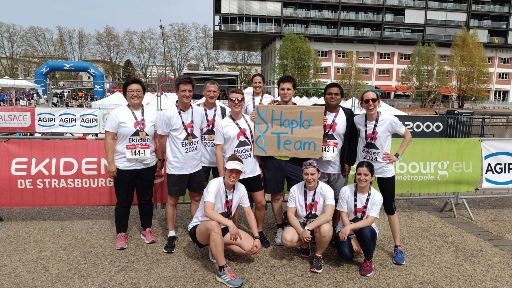
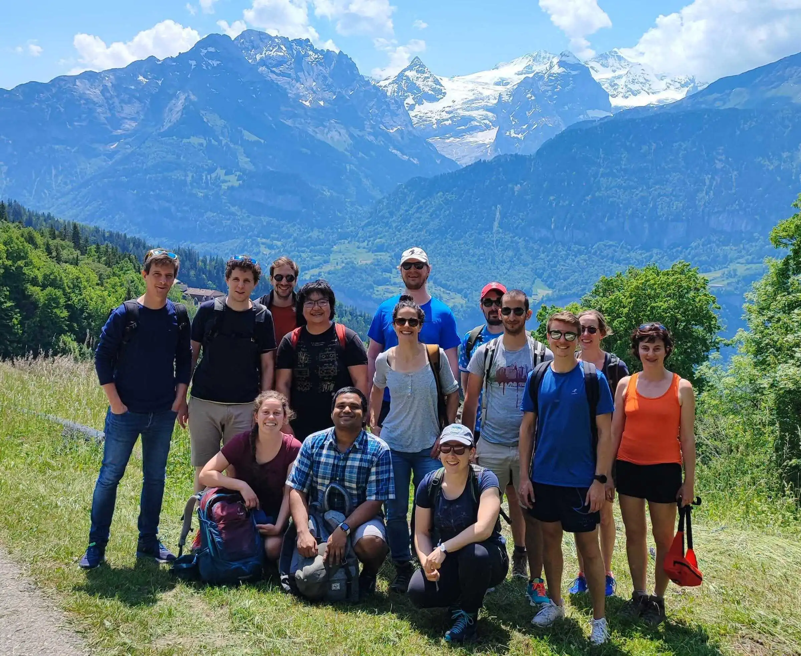
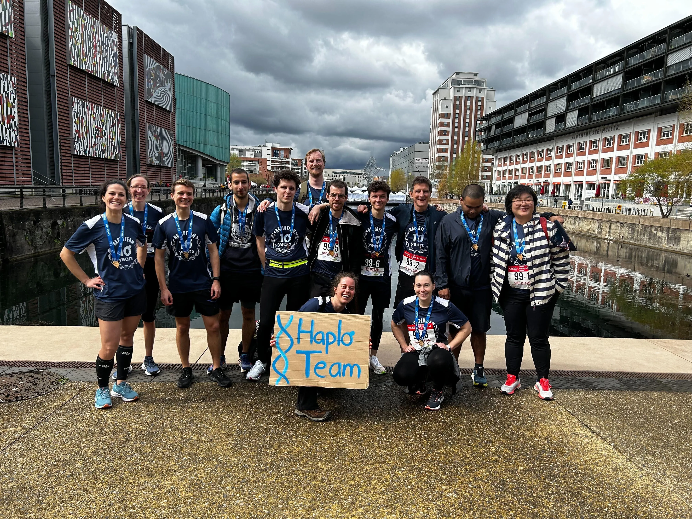
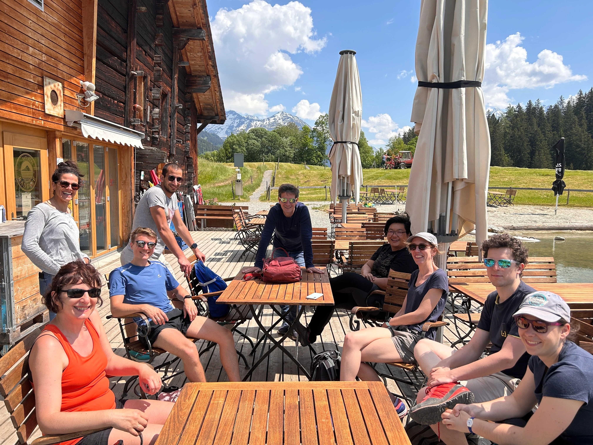
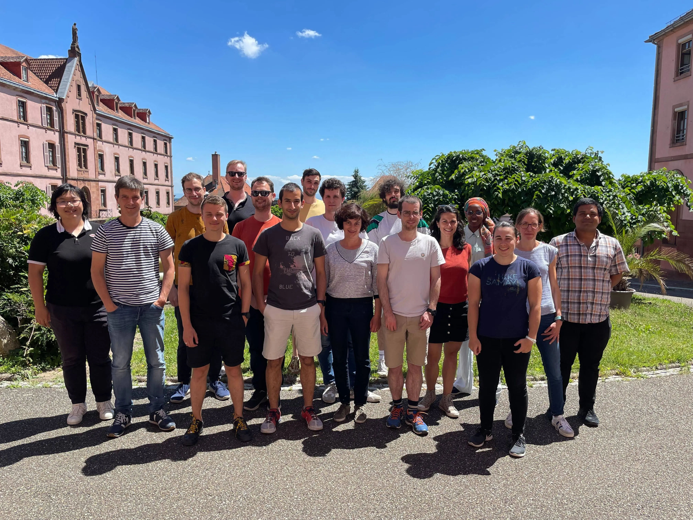
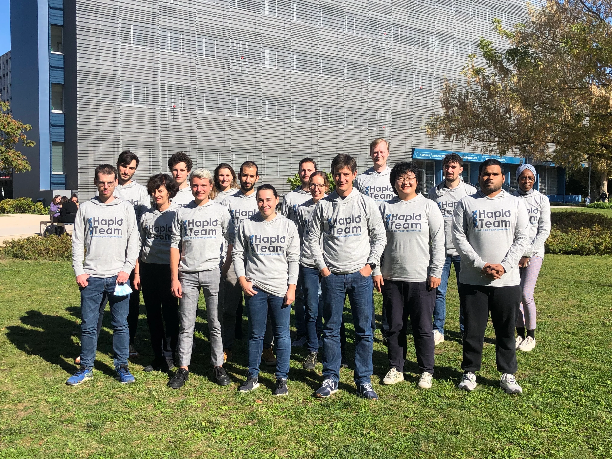

The members of our HaploTeam are listed below. Click on their names to see their profiles!

<h3>Current members</h3>



<!-- <h3>Former members</h3>


 -->

<!-- Gallery layout -->

  <h2>Gallery</h2>
  

    

      

        
        April 2024
      

    

    

      

        
        June 2023
      

    

    

      

        
        April 2023
      

    

  

  

    

      

        
        June 2023
      

    

    

      

        
        June 2022
      

    

    

      

        
        October 2021
      

    

  

<!-- Lightbox overlay -->

  

    &times;
    
  

